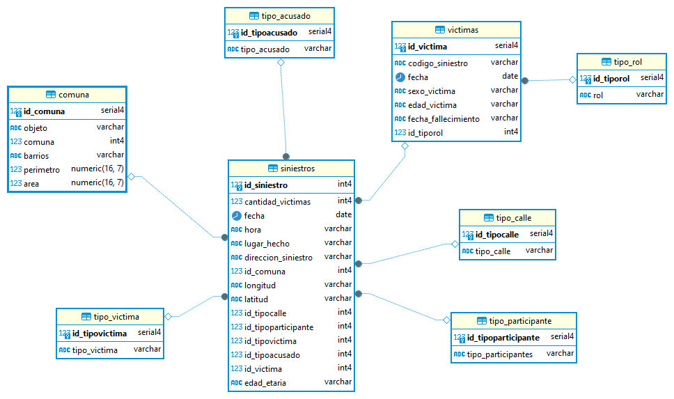
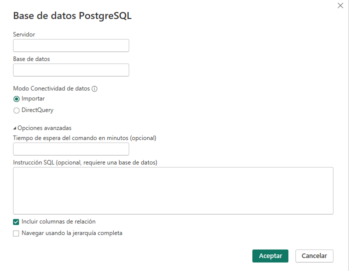

# Contenido

* [Introducción](#Introducción)

* [Propuesta](#Propuesta)

* [Los Datos](#Los-Datos)

* [Tecnologías utilizados](#Tecnologías-utilizados)

* [Análisis y Desarrollo de Datos (EDA)](Análisis-y-Desarrollo-de-los-Datos-(EDA))

* [El Modelo de Datos](#El-Modelo-de-Datos)

* [Indicador clave de rendimiento (KPI)](Indicador-clave-de-rendimiento)

* [Conclusiones](#Conclusioes)

* [Recomendaciones](#Recomendaciones)

* [Recursos](#Recursos)

* [Créditos](#Créditos)

# Introducción
El Machine Learning, o Aprendizaje Automático, ha revolucionado la tecnología actual, impulsando la innovación en diversos campos. Es una rama de la Inteligencia Artificial que dota a las máquinas de la capacidad de aprender y mejorar su rendimiento de forma autónoma, sin necesidad de programación explícita.

Machine Learning está transformando diversos sectores : Salud, Finanzas, Marketing, Manufactura, Transporte, y seguirá evolucionando a pasos agigantados, impulsado por el aumento de datos disponibles, el desarrollo de algoritmos más potentes y la mayor accesibilidad a la computación en la nube. Se espera que tenga un impacto aún mayor en la sociedad, mejorando la calidad de vida y creando nuevas oportunidades en diversos campos.


# Propuesta


# Los Datos


# Tecnólogias utilizadas

Ambiente de base de datos 

- Ambiente de base de Datos<br>

<center>


</center>
<br>

- Ambiente de Desarrollo<br>
<center>


</center>
<br>

- Desarrollo del Dashboard<br>
<center>


</center>


# Análisis Exploratorio de Datos (EDA):


# Modelo de Aprendizaje Automático:


# El Modelo de Datos

Para el desarrollo del modelo de datos se utilizó **PostgreSQL**, una base de datos relacional robusta y escalable. Se emplearon contenedores **Docker** sobre un sistema operativo linux, especificamente **Debian** para aislar el entorno de desarrollo y garantizar la reproducibilidad del modelo.

En una primera etapa, se analizaron archivos csv suministrados por el cliente, luego, a partir de ellos se crearon tablas de dimensión y de hechos, esta estructura de base de datos nos permitiría almacenar información relevante del tema en estudio. Posteriormente, se conectó el modelo de datos a la herramienta de **Power BI**, una herramienta de visualización de datos, para generar reportes interactivos y paneles de control.

Adicionalmente, se utilizó la base de datos para generar conjuntos de datos especificos en formato csv que luego se cargaron en Python, con el propósito de facilitar el analisis del tema en estudio, y generar graficas en el EDA.

Este enfoque basado en utilizar una base de datos PostgreSQL, Docker, permitió crear un modelo de datos robusto, flexible y escalable, que a su vez sirvió como base para la generación de reportes, y la obtención de insights valiosos para el negocio.



Un ejemplo de como se exporto a csv, informacion a partir de una consulta
 que luego sería utilizada en Python

```bash
-- Exporta la tabla siniestros
COPY (SELECT v.codigo_siniestro, v.fecha, v.sexo_victima, v.edad_victima, v.fecha_fallecimiento FROM victimas v 
      INNER JOIN tipo_rol tr ON v.id_tiporol = tr.id_tiporol ) TO '/tmp/victimas.csv' DELIMITER ';' CSV HEADER;

```
Aca la estructura sql de la [base de datos](sql/2_base_de_datos_siniestros_viales.sql) 

Y el [diccionario de datos](sql/diccionario_datos.csv) en formato csv

Ya el paso siguiente es conectar Power BI a la base de datos PostgreSQL, coloque en servidor la direccion IP y el puerto (Ejemplo **196.81.221.106:5433**), nombre de la base de datos (Ejemplo **siniestros_viales**) y haz clic al botón **Aceptar**



## Despliegue de la API:

**Utilización de Render o Railway**: Utilizar una plataforma de despliegue como Render o Railway para alojar la API y hacerla accesible en la web.

## Dataset

El dataset que se presenta a continuación contiene información sobre reseñas de juegos realizadas por usuarios. Esta valiosa colección de datos ofrece una oportunidad única para comprender las preferencias de los jugadores, identificar patrones en las reseñas y desarrollar sistemas de recomendación de juegos más efectivos.

Los datasets pasaran por un proceso ETL, con el propósito de limpiar, transformar y preparar los datos para su análisis posterior. El Análisis Exploratorio de Datos (EDA) se enfocará en explorar las relaciones entre las variables, identificar patrones y obtener una comprensión profunda de las características de las reseñas y los juegos.

### user_review.parquet: Contiene las siguientes atributos o columnas:

* user_id             :  identificador del usuario
* item_id             :  identificador del juego o producto
* recommend           :  Recomendacion positiva o negativa por parte del usuario
* review              :  opinion del jugador dada al juego
* sentiment_analysis  :  un valor dado al juego (0 = malo, 1 = neutral, 2 = positivo)

### developer.parquet: Contiene las siguientes atributos o columnas:

* year                :  año de publicacion          
* item_id             :  identificador del juego o producto
* price               :  precio del juego
* developer           :  empresa desarrolladora

### sentiment_analysis.parquett: Contiene las siguientes atributos o columnas:

* user_id             :  identificador del usuario
* item_id             :  identificador del juego o producto
* recommend           :  Recomendacion positiva o negativa por parte del usuario
* review              :  opinion del jugador dada al juego
* sentiment_analysis  :  un valor dado al juego (0 = malo, 1 = neutral, 2 = positivo)
* item_name           :  nombre del juego o producto

### users_items.parquet: Contiene las siguientes atributos o columnas:

* genres              :  genero al que pertenece el juego o producto
* title               :  titulo del juego o producto
* year                :  año de publicacion
* price               :  precio del juego
* developer           :  empresa desarrolladora
* item_id             :  identificador del juego o producto

# Modelo Similitud del Coseno

Es una herramienta interesante que podemos utilizar en el análisis de grafos. Este se encarga de conocer el ángulo entre dos vectores n-dimensionales en un espacio n-dimensional. Esto siginifica que el resultado que obtenemos es el **producto escalar de los dos vectores dividido por el producto de las longitudes o magnitudes de los dos vectores**.

Dentro de la similitud de coseno dos vectores con la misma orientación tienen una similitud de coseno de 1 , dos vectores orientados a 90° entre sí tienen una similitud de 0, y dos vectores diametralmente opuestos tienen una similitud de -1, independientemente de su magnitud.

Como debemos implementarlo en nuestro codigo

```bash
from sklearn.feature_extraction.text import TfidfVectorizer
from sklearn.metrics.pairwise import cosine_similarity
```
Instanciamos la clase TfidfVectorizer, luego entrena y aplica la transformacion.

```bash
vectorizer = TfidfVectorizer()
tfidf_matrix = vectorizer.fit_transform(df_sentiment_analysis["review"])
```
En el proceso de analisis podemos observar a traves de una nube de palabras los mas jugados


# Api

<h4 align="center">
:construction: Tema en desarrollo :construction:
</h4>

La Api


developer

Para probar ingrese :

Valve


Respuesta


userdata

Para probar ingrese :

Walker1183 <br>
farnellthedog


Respuesta


recomendacion por juego

Para probar ingrese :

11610 <br>
25000


Respuesta


recomendacion por usuario

Para probar ingrese :

Killyis <br>
farnellthedog


Respuesta


[Si quiere ir directo a la Api en Render, clic aqui](https://sistema-de-recomendacion-de-videojuegos-a6c3.onrender.com/docs)

# Recursos

## Imagen Docker con Uvicorn/Guinicorn para aplicaciones web de alta performance:

* [tiangolo/uvicorn-gunicorn-fastapi](https://hub.docker.com/r/tiangolo/uvicorn-gunicorn-fastapi/) <br>

* [uvicorn-gunicorn-fastapi-docker](https://github.com/tiangolo/uvicorn-gunicorn-fastapi-docker) <br>

## FAST API Documentation:

* [Tutorial - User Guide](https://fastapi.tiangolo.com/tutorial/) <br>

## Gradio:

* [Build & share delightful machine learning apps](https://www.gradio.app/) <br>

## Sistemas de Recomendación:

* [awesome-RecSys](https://github.com/juliom86/awesome-RecSys) <br>

* [Sistemas de Recomendación: Similitud del Coseno aplicado con #Python](https://www.youtube.com/watch?v=7nago29IlxM&t=151s)

## "Prolijidad" del codigo:

* [About docstrings and standards](https://pandas.pydata.org/docs/development/contributing_docstring.html) <br>

## Otros 

* [Introduction to Exploratory Data Analysis (EDA)](https://learn.toanhoang.com/courses/take/creating-bespoke-data-visualisations-in-tableau-part-one/lessons/18775341-index-function)

* [Análisis exploratorio de datos (EDA)](https://es.r4ds.hadley.nz/07-eda.html)

# Créditos
Copyright (c) 2024 [Ing. Jesús parra] parra.jesus@gmail.com