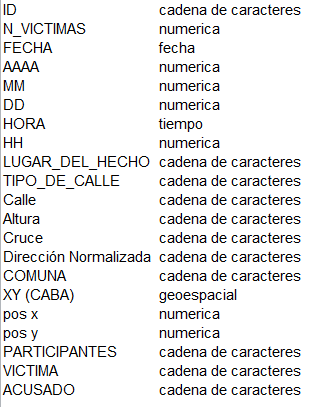
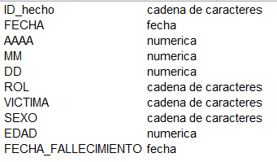
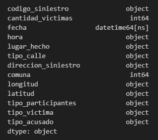
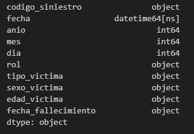

<div align="center">
  <h1 align="center">
    Análisis de datos sobre los Siniestros Viales
      <br />
      
      <br />
  </h1>
</div>

# Contenido

* [Introducción](#Introducción)

* [Propuesta](#Propuesta)

* [Los Datos](#Los-Datos)

* [Tecnologías utilizados](#Tecnologías-utilizados)

* [Análisis Exploratorio de Datos](#Análisis-Exploratorio-de-Datos)

* [El Modelo de Datos](#El-Modelo-de-Datos)

* [Indicador clave de rendimiento (KPI)](Indicador-clave-de-rendimiento)

* [Conclusiones](#Conclusioes)

* [Recomendaciones](#Recomendaciones)

* [Recursos](#Recursos)

* [Créditos](#Créditos)

# Introducción

Los siniestros viales, conocidos también como accidentes de tránsito, son un problema de salud pública que impacta de manera negativa a ciudades de todo el mundo, incluyendo Buenos Aires. Estos eventos, que involucran a vehículos en las vías públicas, pueden tener consecuencias que van desde daños materiales hasta lesiones graves o fatales para los involucrados.

En una ciudad densamente poblada y con un alto volumen de tráfico como Buenos Aires, los siniestros viales representan una preocupación importante. Estos hechos no solo afectan la seguridad de los residentes y visitantes, sino que también pueden tener un efecto significativo en la infraestructura vial, los servicios de emergencia y la calidad de vida en general.

# Propuesta

### Limpieza y preparación de datos:

* Se realizará una búsqueda exhaustiva de valores faltantes, outliers y registros duplicados. Se aplicarán las técnicas adecuadas para tratar estos casos, como la eliminación de registros incompletos o la imputación de valores faltantes.
* Se verificará la consistencia y validez de los datos, asegurando que los valores estén dentro de rangos razonables y que no existan incoherencias.

### Análisis descriptivo:

- Se utilizarán medidas de resumen como la **media**, **mediana**, **moda**, **desviación estándar**, **rango** y **cuartiles** para describir las variables numéricas.
- Para las variables categóricas, se calcularán frecuencias y porcentajes, además de medidas de asociación como el chi-cuadrado o el índice de correlación de Cramer.
- Se elaborarán gráficos y tablas adecuados para visualizar la distribución de las variables y las relaciones entre ellas. Se utilizarán histogramas, diagramas de cajas, gráficos de barras y dispersión, entre otros.

### Conclusiones y recomendaciones:

- Se sintetizarán los hallazgos más importantes del EDA, destacando las características principales del conjunto de datos, los patrones identificados y las posibles anomalías.

- Se formularán recomendaciones para el tratamiento posterior de los datos, en función de los resultados obtenidos. Esto puede incluir la transformación de variables, la selección de subconjuntos de datos o la aplicación de técnicas de reducción de dimensionalidad.

# Los Datos

El conjunto de datos entregado para el estudio, consta de un archivo Excel que puede descargarlo [aquí](datasets/homicidios.xlsx), este se encuentra estructurado en cuatro hojas, dos de las las cuales vienen organizados en columnas y las otras dos es información que describen los mismos. La primera hoja llamada **HECHOS**, contiene 20 columnas de datos representados entre datos cualitativos (nominales y categoricos) y numericos, este conjunto suman **696 registros**, luego la hoja siguiente **DICCIONARIO_HECHOS**, como fue mencionado es informativa, describe las 20 variables de la hoja de **HECHOS**. Y tenemos la hoja de **VICTIMAS** que contiene 10 columnas y **717 registros**, de manera similar tiene asociado una hoja de **DICCIONARIO_VICTIMAS** que describe sus campos

En relación al tipo de datos se pueden observar las siguientes imágenes

de HECHOS 



y de VICTIMAS




Finalmente los datos fueron entregado por nuestro cliente **Observatorio de Movilidad y Seguridad Vial (OMSV)**, centro de estudios que se encuentra bajo la órbita de la **Secretaría de Transporte del Gobierno de la Ciudad Autónoma de Buenos Aires**.


# Tecnologías utilizados

Ambiente de base de datos 

- Ambiente de base de Datos<br><center>


</center>
<br>

- Ambiente de Desarrollo<br><center>


</center>
<br>

- Desarrollo del Dashboard<br><center>


</center>


# Análisis Exploratorio de Datos

A través de este proceso que corresponde al EDA, obtendremos una visión general de la estructura de los datos, la calidad y las relaciones entre las variables. Este conocimiento fundamental será esencial para guiar nuestros pasos posteriores del análisis, que va desde la limpieza, la preparación o tratamiento, hasta la construcción de un modelo de datos y la toma de decisiones informadas.

Entonces a continuación mostraremos algunas características de los datos, patrones y tendencias, incluyendo anomalías.

**Tipos de datos**
Dataframe homicidios_hechos <br />
 

Dataframe homicidios_victimas <br />
 


# El Modelo de Datos

Para el desarrollo del modelo de datos se utilizó **PostgreSQL**, una base de datos relacional robusta y escalable. Se emplearon contenedores **Docker** sobre un sistema operativo linux, especificamente **Debian** para aislar el entorno de desarrollo y garantizar la reproducibilidad del modelo.

En una primera etapa, se analizaron archivos csv suministrados por el cliente, luego, a partir de ellos se crearon tablas de dimensión y de hechos, esta estructura de base de datos nos permitiría almacenar información relevante del tema en estudio. Posteriormente, se conectó el modelo de datos a la herramienta de **Power BI**, una herramienta de visualización de datos, para generar reportes interactivos y paneles de control.

Adicionalmente, se utilizó la base de datos para generar conjuntos de datos especificos en formato csv que luego se cargaron en Python, con el propósito de facilitar el analisis del tema en estudio, y generar graficas en el EDA.

Este enfoque basado en utilizar una base de datos PostgreSQL, Docker, permitió crear un modelo de datos robusto, flexible y escalable, que a su vez sirvió como base para la generación de reportes, y la obtención de insights valiosos para el negocio.


Un ejemplo de como se exporto a csv, informacion a partir de una consulta
 que luego sería utilizada en Python

```bash
-- Exporta la tabla siniestros
COPY (SELECT v.codigo_siniestro, v.fecha, v.sexo_victima, v.edad_victima, v.fecha_fallecimiento FROM victimas v 
      INNER JOIN tipo_rol tr ON v.id_tiporol = tr.id_tiporol ) TO '/tmp/victimas.csv' DELIMITER ';' CSV HEADER;

```
Aca la estructura sql de la [base de datos](sql/2_base_de_datos_siniestros_viales.sql) 

Y el [diccionario de datos](sql/diccionario_datos.csv) en formato csv

De igual modo junto un backup de la base de datos [base de datos](sql/siniestros_viales-202406021035.sql)

Ya el paso siguiente es conectar Power BI a la base de datos PostgreSQL, coloque en servidor la direccion IP y el puerto (Ejemplo **196.81.221.106:5433**), nombre de la base de datos (Ejemplo **siniestros_viales**) y haz clic al botón **Aceptar**


# Recursos

* [¿Cuáles son las principales causas de accidentes de tránsito?](https://satrack.com/ec/blog/cuales-son-las-principales-causas-de-accidentes-de-transito/)

* [11 medidas para la prevención de accidentes de tráfico](https://www.alimentatubienestar.es/prevencion-de-accidentes-de-trafico/)* [Análisis exploratorio de datos (EDA)](https://es.r4ds.hadley.nz/07-eda.html)

# Créditos
Copyright (c) 2024 [Ing. Jesús parra] parra.jesus@gmail.com